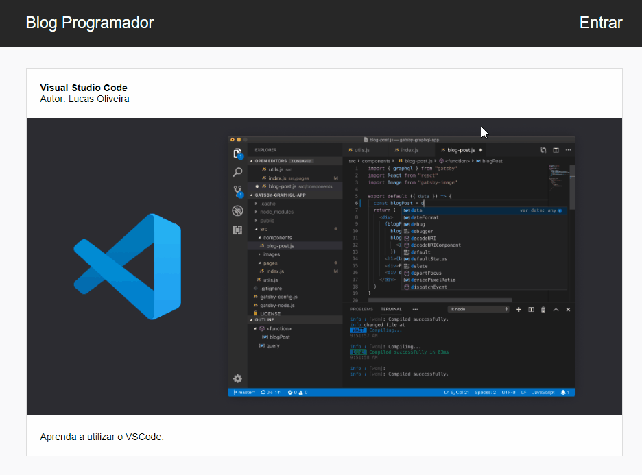

<h1 align="center">
Blog Programador
</h1>

    

## Sobre o Projeto

Esse projeto foi desenvolvido durante o curso do Matheus Fraga.

O Blog Programador é uma página web simples. Nele o usuário consegui fazer login/registrar e fazer novos posts no seu dashboard, conseguindo fazer upload de arquivos. Foi utilizado o banco de dados Firebase. 

## Tecnologias:

Algumas ferramentas foram utilizadas para o seu desenvolvimento. Entre elas estão:

:white_check_mark: ReactJS  
:white_check_mark: Firebase  

Made with by :computer: LUCAS OLIVEIRA :computer: